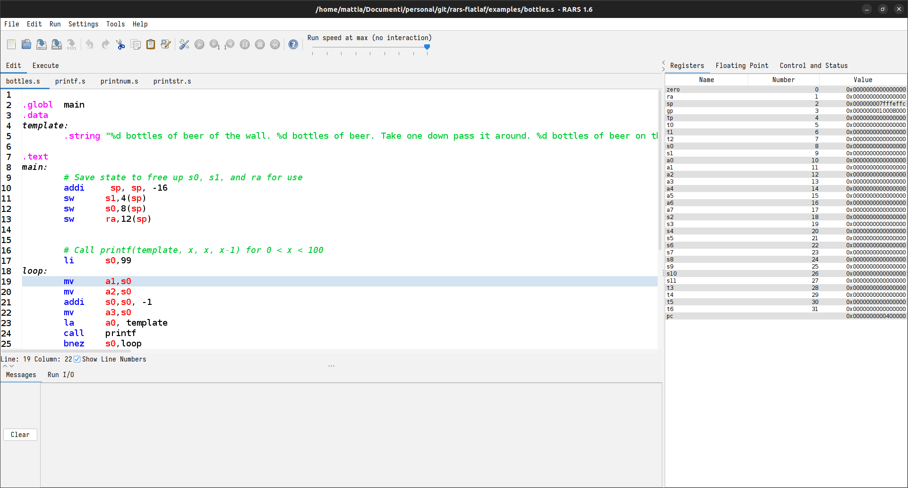

RARS -- RISC-V Assembler and Runtime Simulator
----------------------------------------------

RARS, the RISC-V Assembler, Simulator, and Runtime, will assemble and simulate
the execution of RISC-V assembly language programs. Its primary goal is to be
an effective development environment for people getting started with RISC-V. 

## Features

  - RV32IMF ISA with some support for user level interrupts.
  - Several system calls that match behaviour from MARS or SPIKE.
  - Support for debugging using breakpoints and/or `ebreak`
  - Side by side comparison from psuedo-instruction to machine code with
    intermediate steps
  - Multifile assembly using either files open or a directory

## Download

RARS is distributed as an executable jar. You will need at least Java 8 to run it. 

The latest stable release can be found [here](https://github.com/TheThirdOne/rars/releases/latest), a release with the latest developments can be found on the [continuous release](https://github.com/TheThirdOne/rars/releases/tag/continuous), and the [releases page](https://github.com/TheThirdOne/rars/releases) contains all previous stable releases with patch notes.

## Screenshot

## Changes from MARS 4.5

RARS was built on MARS 4.5 and owes a lot to the development of MARS; its
important to note what are new developments and what come straight from MARS.
Besides moving from supporting MIPS to RISC-V and the associated small changes,
there are several general changes worth noting.

  - Instructions can now be hot-loaded like Tools. If you want to support an additional extension to the RISC-V instruction set. the .class files just need to be added to the right folder
  - ScreenMagnifier, MARS Bot, Intro to Tools, Scavenger Hunt, and MARS Xray were removed from the included tools. ScreenMagnifier, MARS Bot, Intro to Tools, and Scavenger Hunt were removed because they provide little benefit. And MARS Xray was removed because it is not set up to work with RISC-V, however if someone ports it, it could be merged in.
  - Removed delayed branching
  - Removed the print feature
  - Added a testing framework to verify compatability with the RISC-V specification
  - Significant internal restructuring and refactoring.

## Future improvements

RARS is currently a useful tool, but there is definitely still room for improvement.
  - Support assembling to and simulating from the ELF format
  - Support more standard extensions (such as Doubles or Atomics)
  - Support more Linux system calls and have directly compatible behaviour with Spike
  - Eliminate known bugs

